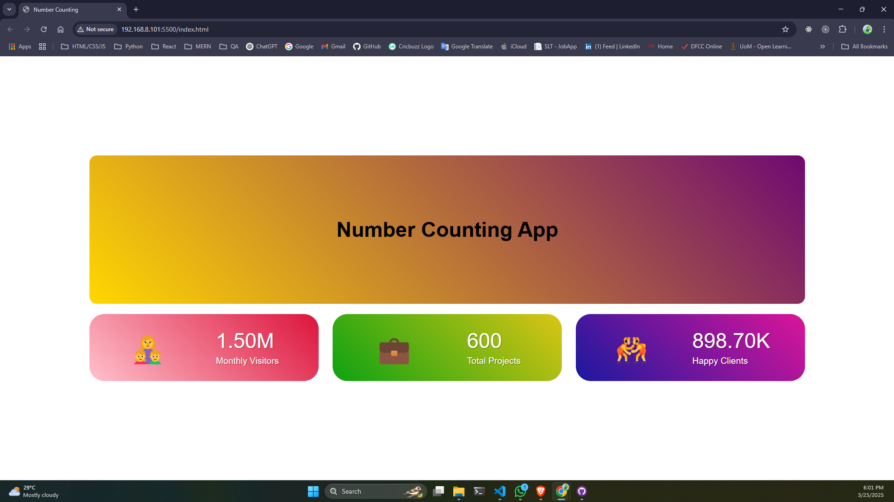

# Number Counting App



## Overview
The **Number Counting App** is a simple web-based project that dynamically animates numerical statistics such as Monthly Visitors, Total Projects, and Happy Clients. It uses HTML, CSS, and JavaScript to create an engaging counter animation.

## Features
- Animated counting effect
- Stylish gradient backgrounds
- Interactive hover effects
- Responsive design

## Technologies Used
- **HTML** - Structure of the webpage
- **CSS** - Styling and layout
- **JavaScript** - Counter animation functionality

## Installation
1. Clone the repository:
   ```bash
   git clone https://github.com/your-username/number-counting-app.git
   ```
2. Navigate to the project directory:
   ```bash
   cd number-counting-app
   ```
3. Open `index.html` in your browser.

## File Structure
```
number-counting-app/
│── index.html      # Main HTML file
│── style.css       # Stylesheet
│── script.js       # JavaScript file
└── README.md       # Project documentation
```

## Usage
- Open `index.html` in a browser.
- The counters will automatically animate from `0` to their respective target numbers.
- Hover over the header and counters to see interactive effects.

## Code Explanation
### JavaScript Counter Logic
The counter animation is implemented using JavaScript with `setInterval()`:
```js
const counters = document.querySelectorAll(".counter");
counters.forEach((counter) => {
  let initial_count = 0;
  const final_count = counter.dataset.count;
  const counting = setInterval(updateCounting, 500);

  function updateCounting() {
    if (initial_count < 1000) {
      initial_count += 5;
      counter.innerText = initial_count;
    } else if (initial_count < 1000000) {
      initial_count += 5000;
      counter.innerText = (initial_count / 1000).toFixed(2) + "K";
    } else {
      initial_count += 500000;
      counter.innerText = (initial_count / 1000000).toFixed(2) + "M";
    }

    if (initial_count >= final_count) {
      clearInterval(counting);
    }
  }
});
```

## License
This project is licensed under the MIT License - see the [LICENSE](LICENSE) file for details.

## Author
[Your Name](https://github.com/your-username)

